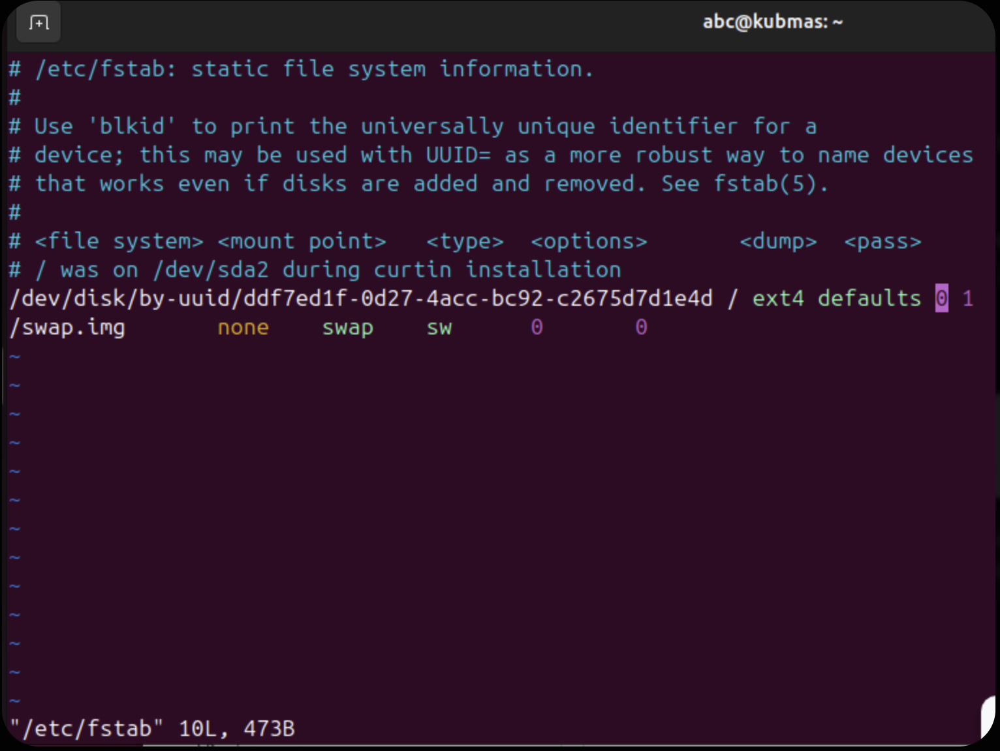
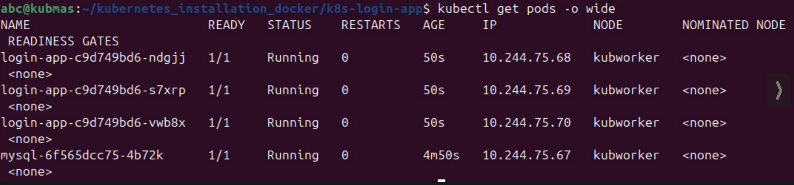
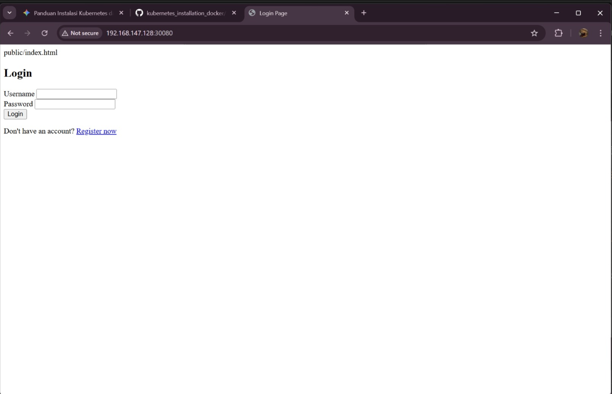

### Anggota Kelompok:
* **Fadhlullah Akmal** - [235150207111068]
* **Nugrah Ramadhani** - [235150200111059]

# Dokumentasi Tugas: Instalasi Kubernetes & Deployment Aplikasi 3 Replicas

Dokumentasi ini disusun untuk memenuhi tugas praktikum membangun cluster Kubernetes lokal menggunakan VM dan mendeploy aplikasi web dengan database MySQL.

## 1. Spesifikasi Environment
Dalam percobaan ini, digunakan 2 buah Virtual Machine (VM) dengan spesifikasi sebagai berikut:
* **OS:** Ubuntu Server 24.04 LTS
* **Hypervisor:** VMware Workstation
* **Network:** Bridged Adapter (Berada dalam satu segmen jaringan fisik)
* **Nodes:**
    * **Master Node:** 2 vCPU, 4GB RAM, 25GB Disk (IP: 192.168.147.128)
    * **Worker Node:** 2 vCPU, 4GB RAM, 25GB Disk

## 2. Langkah-Langkah Instalasi
### A. Persiapan Node
1. Menonaktifkan SWAP pada kedua node (`sudo swapoff -a`).

2. Mengonfigurasi modul kernel `overlay` dan `br_netfilter`.
3. Mengonfigurasi `sysctl` untuk *IP Forwarding* dan *Bridge Netfilter*.

### B. Instalasi Container Runtime & K8s
1. Menginstal **Docker Engine** sebagai runtime.
2. Menginstal **cri-dockerd** sebagai adapter CRI agar Kubernetes dapat berkomunikasi dengan Docker.
3. Menginstal komponen utama Kubernetes: `kubeadm`, `kubelet`, dan `kubectl`.

### C. Inisialisasi Cluster
1. Menjalankan `kubeadm init` pada Master Node dengan CIDR jaringan 10.244.0.0/16.
2. Menginstal **Calico CNI** (Tigera Operator) untuk manajemen jaringan antar Pod.
3. Menggabungkan Worker Node ke Master menggunakan perintah `kubeadm join` disertai parameter `--cri-socket`.

## 3. Deployment Aplikasi (login-app)
Sesuai instruksi, aplikasi dideploy dengan spesifikasi:
1. **Database:** MySQL menggunakan *Persistent Volume* lokal di direktori `/mnt/data` pada Worker Node.
2. **Replicas:** Mengubah konfigurasi pada `web-deployment.yaml` dari 2 replicas menjadi **3 replicas**.
3. **Build Image:** Melakukan build image docker `login-app:latest` secara lokal di Worker Node.

## 4. Hasil Percobaan (Screenshot)

### A. Verifikasi Pods dan Replicas
Perintah `kubectl get pods -o wide` menunjukkan bahwa aplikasi telah berjalan dengan 3 buah replika (pod) yang tersebar di node worker, serta 1 pod MySQL yang sudah running.

### B. Verifikasi Akses Web (Browser)
Aplikasi berhasil diakses melalui browser laptop utama menggunakan alamat IP Master Node dan port **30080** (NodePort).

## 5. Kesimpulan
Seluruh tahapan mulai dari instalasi cluster hingga deployment aplikasi dengan 3 replika telah berhasil dilaksanakan. Aplikasi dapat berkomunikasi dengan database MySQL dan dapat diakses dari luar cluster melalui jaringan Bridged.